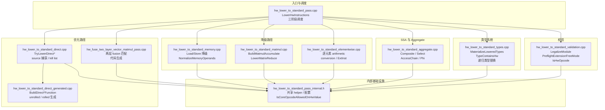
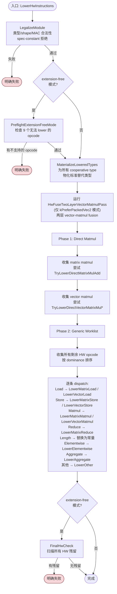
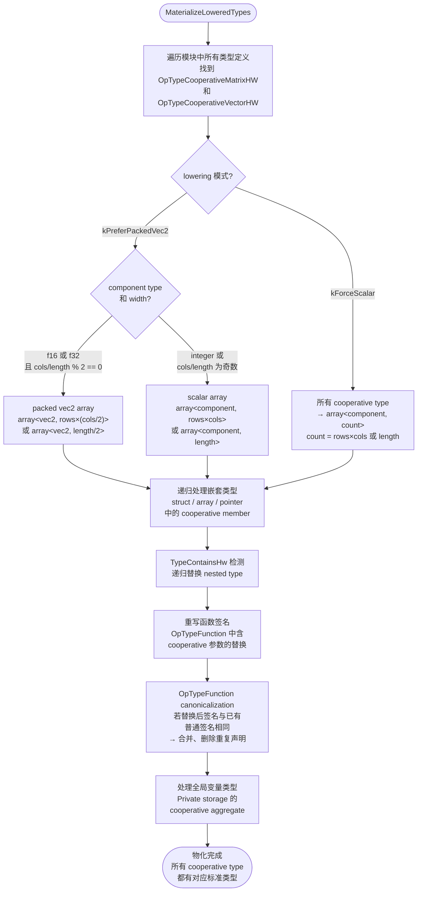
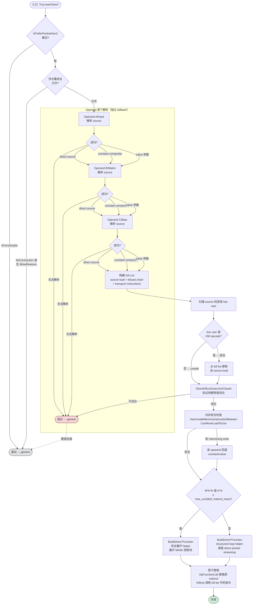
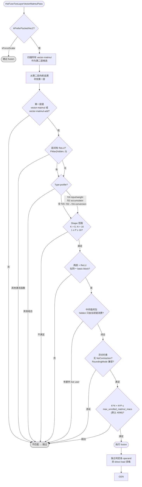
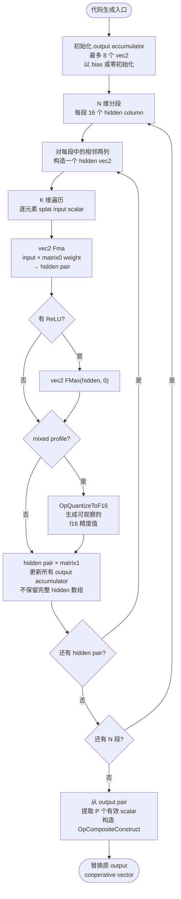
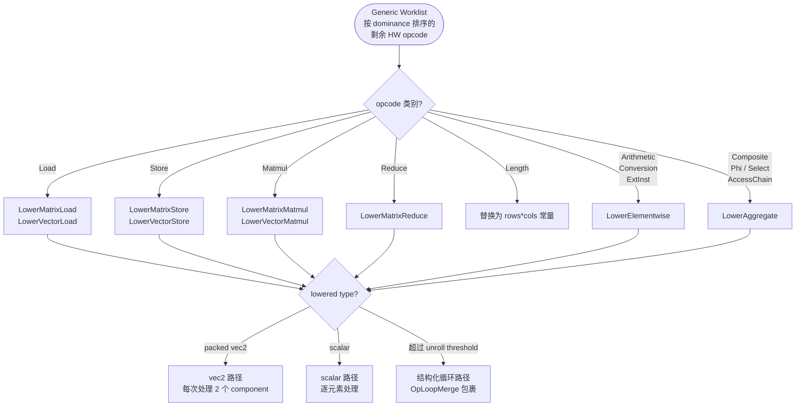
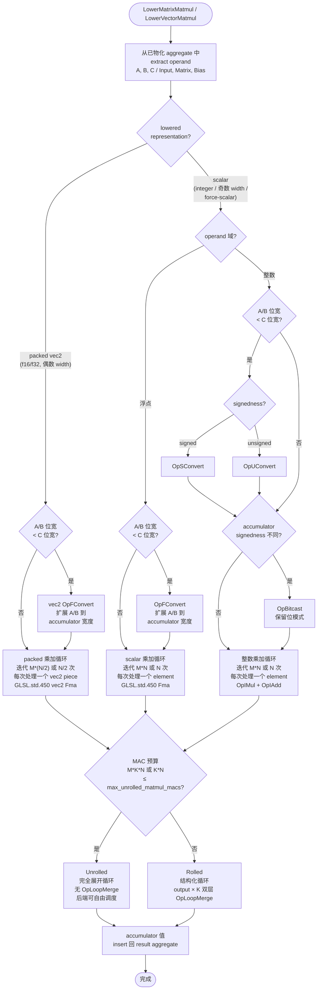
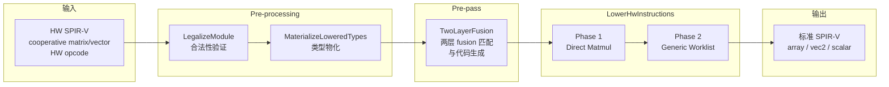

# HW Lower-to-Standard Pass 技术设计

> 本文档聚焦 pass 的**架构设计与执行流程**，与 [`hw_lower_to_standard_supported_features.md`](hw_lower_to_standard_supported_features.md)（功能规格说明）互补。功能细节、支持矩阵和边界条件请参阅功能规格文档。

## 1. 概述

HW lower-to-standard pass 的目标是将使用 `SPV_HW_neural_shader` extension 的 cooperative matrix/vector HW opcode 降级为标准 SPIR-V，使下游编译器和硬件无需专用 HW extension 支持即可执行。

pass 以 SPIR-V optimizer pass 的形式实现，位于 `External/spirv-tools/source/opt/` 目录下。

### 两种运行模式

| 模式 | CLI 选项 | 行为 |
|---|---|---|
| **cooperative-only** | `--hw-lower-to-standard` | 降级已知 cooperative opcode，允许其他 HW opcode 保留 |
| **extension-free** | `--hw-lower-to-standard-extension-free` | 成功时保证不残留任何 HW opcode/capability/extension |

extension-free 模式在 cooperative-only 的基础上增加了严格预检（`PreflightExtensionFreeMode`）和最终残留扫描（`FinalHwCheck`），对无法等价 lower 的 9 个 opcode（TensorMap、CpAsync、Barrier、Shuffle 等）会明确失败。

### 核心设计原则

1. **两阶段调度保证**：fusion pre-pass → direct → generic，优先级从高到低，高优先级路径失败不阻止低优先级路径继续处理。
2. **原子替换语义**：所有降级路径先完成条件验证，再构建替换 IR，最后一次性替换整个指令链。不在 IR 上进行试探性修改。
3. **独立 operand fallback**：direct 路径中每个 operand 的 source 捕获独立判定，单个 operand 无法解析为 direct source 时只回退该 operand，不取消整条路径。
4. **闭合性检查**：direct 和 fusion 路径都要求待删除的指令链闭合——所有 user 要么在 kill list 中，要么是安全的 HW opcode user。

## 2. 模块架构

pass 由 10 个源文件组成，按职责划分为入口调度、校验、类型、内存、计算、优化路径和 SSA/aggregate 处理。

### 各模块职责

| 模块 | 文件 | 核心职责 |
|---|---|---|
| 入口调度 | `hw_lower_to_standard_pass.cpp` | pass 入口，三阶段 dispatch，最终 HW 残留扫描 |
| 校验 | `hw_lower_to_standard_validation.cpp` | 类型/shape/MAC 合法性检查，spec-constant 拒绝，extension-free 预检 |
| 类型系统 | `hw_lower_to_standard_types.cpp` | cooperative type → standard type 的物化，嵌套类型递归替换，函数签名重写 |
| 内存 | `hw_lower_to_standard_memory.cpp` | Load/Store 降级为 packed/scalar/loop，MemoryAccess 传播与收紧 |
| 计算 | `hw_lower_to_standard_matmul.cpp` | generic matmul（scalar/vec2 Fma 循环），mixed-precision widening，reduce |
| 逐元素 | `hw_lower_to_standard_elementwise.cpp` | cooperative arithmetic/conversion/ExtInst 的逐元素降级 |
| Direct 入口 | `hw_lower_to_standard_direct.cpp` | SSBO direct 路径的条件判定、source 捕获、kill list 构建 |
| Direct 生成 | `hw_lower_to_standard_direct_generated.cpp` | unrolled/rolled helper 函数的 SPIR-V 代码生成 |
| Fusion | `hw_fuse_two_layer_vector_matmul_pass.cpp` | 两层 vector-matmul fusion 的匹配、direct load、标量化生成 |
| Aggregate | `hw_lower_to_standard_aggregate.cpp` | OpPhi/OpSelect/CompositeConstruct/Extract/Insert/AccessChain 的降级 |

## 3. 整体调度流程

`LowerHwInstructions` 是 pass 的核心调度函数，它按固定顺序处理模块中的所有 HW opcode。调度分为两个阶段，加上一个前置的 fusion pre-pass。

### 两阶段调度的设计理由

**Pre-pass（两层 Fusion）** 在主调度之前运行，因为 fusion 将两个相邻的 vector-matmul 合并为一段标量化代码，消除了中间 cooperative vector 的物化。fusion 成功后的输出是普通 `OpCompositeConstruct`，不再被后续阶段识别为 cooperative 值，因此不会与 direct 或 generic 路径冲突。

**Phase 1（Direct Matmul）** 优先于 generic 路径，因为 direct 路径通过捕获 SSBO pointer 按需加载 operand，避免了 cooperative aggregate 的完整物化。direct 路径对 matmul 的 operand 获取方式做了根本性改变，必须在 generic 路径之前执行——generic 路径会从已经物化的 aggregate 中逐元素 extract。

**Phase 2（Generic Worklist）兜底**，处理所有未被 direct 路径优化的指令。worklist 按 dominance 排序确保先处理定义、后处理使用。

### 调度不变量

- 每个阶段只处理**尚未被降级**的 HW opcode——已被 fusion 或 direct 替换的指令不会出现在后续阶段的 worklist 中。
- Direct 路径的失败不修改 IR——条件验证在 IR 修改之前完成，不满足条件则跳过，指令留给 generic worklist。
- Generic worklist 中每条指令的降级是独立的——一条指令的降级失败会立即报错，不会污染后续指令。

## 4. 类型物化流程

类型物化（`MaterializeLoweredTypes`）在调度之前运行，为模块中所有 cooperative type 预先创建对应的标准 SPIR-V 类型。这确保后续降级阶段可以直接查找已物化的类型，而无需在替换指令时现场创建。

### 类型决策的核心逻辑

packed vec2 表示是性能优化的关键路径：对于 f16/f32 且宽度为偶数的 cooperative value，使用 `array<vec2, N>` 可以让后续的 extract/insert 操作一次处理两个 component，减少循环迭代次数和索引计算。f16vec2 尤其重要——它在大多数 GPU 上可以映射为单条 32-bit 寄存器操作。

当宽度为奇数（如 5×7 matrix）或 component type 为 integer 时，回退到 scalar array。odd-width 不使用 "vec2 + scalar tail" 的混合布局——整个 cooperative value 统一为 scalar array，简化了地址计算和循环生成。

`force-scalar` 模式强制所有类型使用 scalar array，主要用于调试和验证。

### 函数签名重写的特殊处理

函数参数和返回值中的 cooperative type 替换后，可能导致两个 `OpTypeFunction` 的签名完全相同。例如一个函数原来接受 `(cooperative_matrix<f16, 4, 4>, float)`，替换后变成 `(array<vec2, 8>, float)`——如果模块中已有接受 `(array<vec2, 8>, float)` 的函数类型声明，就需要 canonicalization：

1. 将所有引用旧函数类型的指令改为引用已有类型。
2. 删除重复的函数类型声明。
3. 确保 `OpFunction`、`OpFunctionCall` 和 `OpReturnValue` 的类型一致性。

## 5. Direct Path 决策流程

Direct path 的核心思想是避免将 cooperative matrix/vector 从 SSBO 完整物化到 Function aggregate，而是捕获原始 buffer pointer，在生成的 helper 函数中按需加载 operand。

### 入口与分流

Direct path 有两个入口，分别处理 matrix-matmul 和 vector-matmul：

- **Matrix direct**: `TryLowerDirectMatrixMulAdd` — 处理 `OpCooperativeMatrixMulAddHW`
- **Vector direct**: `TryLowerDirectVectorMatrixMulPackedVec2` — 处理 `OpCooperativeVectorMatrixMulHW` 和 `OpCooperativeVectorMatrixMulAddHW`

两者共享相同的决策框架，但在 operand 解析细节上有所不同。

### 三层回退语义

Direct path 有三个不同粒度的回退层级，理解它们的区别至关重要：

1. **Operand 级 fallback**：单个 operand 无法解析为 direct source（例如 matrix 来自 UBO constant 而非 SSBO load），仅该 operand 改为 constant 或 value 参数。其他 operand 的 direct source 不受影响。这发生在"Operand 逐个解析"阶段。

2. **整条 Direct 回退**：安全性检查失败（kill list 不闭合、存在 unsafe memory instruction、浮点重结合不允许等），整条 matmul 放弃 direct 路径，交给 Phase 2 generic worklist 处理。这发生在条件验证阶段。

3. **共享 source 的安全处理**：当 source load 被多个 matmul 共享时，shared user 如果也是 HW opcode（如另一个 matmul），则被视为"安全 live user"，source load 从 kill list 移除但保留在 IR 中供其他用户使用。这不是回退——direct 路径仍然执行，只是 kill list 变小。

### Matrix Direct 的 Type Transport 规则

Matrix direct 对 operand 的 type transport chain 有特殊约束：

- 允许不改变 component type 和 shape 的 transport（如 bitcast 仅改变 use tag：`MatrixUseAHW → MatrixAccumulatorHW`）。
- 拒绝 component type 或 shape 变化的 transport——这会取消整条 matrix direct 并走 generic 路径。
- C operand 上的 `OpFConvert` **不被吸收**——这是 matrix direct 与 vector direct 的关键区别。vector direct 可以吸收 f16→f32 的 converted bias。

### Kill List 与闭合性

Kill list 包含 direct 路径打算删除的所有指令：source load、bitcast chain、function transport store/load 等。闭合性检查（`DirectKillListUsersAreClosed`）确保 kill list 中每条指令的所有 user 要么也在 kill list 中，要么已被识别为安全 user。

这个检查防止了一个关键问题：如果删除了 source load，但该 load 的某个 user 不在 kill list 中且不是 HW opcode，那个 user 就会引用一个不存在的值——IR 会进入不一致状态。

## 6. Fusion 匹配与生成流程

Fusion 是 lower pass 中最复杂的优化路径。当前实现的 fusion 为两层 vector-matmul fusion（`HwFuseTwoLayerVectorMatmulPass`），将两个相邻的 vector-matmul 合并为一段标量化代码。

### 两层 Vector-Matmul Fusion 匹配流程

`HwFuseTwoLayerVectorMatmulPass` 在主 lowering 之前运行，以第二层 vector-matmul 为入口，向前追溯可融合的第一层。

### 代码生成流程

fusion 匹配成功后，直接生成标量/vec2 算术代码，不物化完整的 hidden cooperative vector。

### 关键设计决策

**N 按 16 分片**：每段处理 16 个 hidden column，以相邻两列组成一个 vec2。这个分片大小平衡了代码展开量和寄存器压力。N 的最后一段可能不足 16 列，奇数 hidden lane 使用零补齐，不会生成越界 extract。

**不物化完整 hidden vector**：这是 fusion 的核心收益。每处理完一个 hidden pair，立即用它更新所有 output accumulator，然后丢弃 hidden 值。这避免了分配和填充一个长度为 N 的中间数组——对于 N=48 的 MLP hidden layer，这意味着省掉了 48 个 f32（或 24 个 f16vec2）的 aggregate 存储。

**Mixed profile 的 OpQuantizeToF16**：当第一层产生 f32 hidden、但第二层期望 f16 input 时，fusion 不直接使用 f32 hidden 参与第二层计算（那会静默提升精度），而是插入 `OpQuantizeToF16` 模拟原 shader 中 f32→f16 的精度损失。这确保 fusion 后的计算结果与原 shader 逐层执行时的 bit-exact 行为一致。

### 多层链贪心配对

对于超过两层的 MLP 链，fusion 采用贪心、非重叠的两层配对策略：

- 以每个 matmul 作为第二层候选，向前追溯尚未被消费的第一层。
- 成功 fusion 后，生成的 `OpCompositeConstruct` 是普通 composite，不会再次充当另一 pair 的 cooperative 第一层。
- 每个 pair 的 MAC budget 独立计算，不按整条 MLP 链累计。

示例：

| MLP 结构 | Fusion 结果 |
|---|---|
| 4 层 `L1→L2→L3→L4` | `(L1,L2)` + `(L3,L4)` 两个 pair |
| 5 层 `L1→L2→L3→L4→L5` | `(L1,L2)` + `(L4,L5)`，L3 进入普通 lowering |
| 3 层 `L1→L2→L3`（L2 的 N=8） | `(L1,L2)` 不满足 N>16 → 不融合，尝试 `(L2,L3)` |

### Direct Load 在 Fusion 内的独立判定

Fusion 会分别尝试将 matrix0、matrix1、bias0、bias1 从 cooperative load 改为按需 scalar load。四个 operand 独立判定：

- 某个 operand 不满足 direct 条件（例如 pointer 不可捕获、shape 不是 module-visible 常量），仅该 operand 保留 aggregate extract 路径。
- 这不会关闭其他 operand 的 direct load，也不会导致整个 pair 取消 fusion。
- mixed profile 额外允许吸收 f16 load 后紧邻的 f32 `OpFConvert`，按需 scalar load 后恢复同一 conversion 及其 `FPFastMathMode`。

## 7. Generic 变换流程

Generic worklist 是 pass 的兜底阶段，处理所有未被 fusion pre-pass 和 direct path 优化的 HW opcode。每条指令按 dominance 顺序逐条降级，将 cooperative 值替换为已物化的标准 aggregate（packed vec2 array 或 scalar array）上的逐元素操作。

### 整体 Dispatch 结构

### 7.1 Load 降级

`LowerMatrixLoad` 和 `LowerVectorLoad` 将 `OpCooperativeMatrixLoadHW` / `OpCooperativeVectorLoadHW` 替换为从 SSBO pointer 逐元素或逐 vec2 加载到已物化的 aggregate 中。

**地址计算**：

- Matrix RowMajor：`(offset.row + row) * shape.cols + offset.col + col`
- Matrix ColumnMajor：`(offset.col + col) * shape.rows + offset.row + row`
- Vector：`offset + logical_index`

**三条代码路径**：

| 路径 | 条件 | 生成代码 |
|---|---|---|
| Packed vec2 | f16/f32 且 cols/length 为偶数，且 `rows*cols/2` 或 `length/2` 不超过 unroll threshold | 循环 `rows*(cols/2)` 次，每次从 buffer 加载一个 vec2（两个相邻 component 组成） |
| Scalar | integer 或奇数宽度，且 element 数不超过 unroll threshold | 循环 `rows*cols` 或 `length` 次，每次加载一个 scalar |
| Structured loop | element 数超过 `max_unrolled_elements`（默认 4096）| 三层嵌套循环（matrix：output row × col；vector：单循环），带 `OpLoopMerge` |

对于 matrix，packed vec2 路径的循环变量遍历 row 和 `col/2`，每轮通过 `OpAccessChain` 定位 SSBO 中的两个相邻 component，构造一个 vec2 并存入 aggregate 对应位置。scalar 路径直接遍历每个 (row, col) 对。

MemoryAccess operand（`Aligned`、`Nontemporal`、`MakePointerVisible` 等）会传播到生成的 load 指令。`Aligned` 会根据 component 自然对齐和已知 byte offset 安全收紧——例如 f16 component 在 offset=0 时 `Aligned` 可以收紧到 2 字节。

### 7.2 Store 降级

`LowerMatrixStore` 和 `LowerVectorStore` 与 load 对称，将 cooperative store 替换为从 aggregate 逐元素或逐 vec2 写入 SSBO。

地址计算和路径选择与 load 完全相同。MemoryAccess operand 同样传播。区别在于 store 读取的是已物化 aggregate 中的值（通过 `OpCompositeExtract` 或 `OpAccessChain` + `OpLoad`），而不是写入。

### 7.3 Generic Matmul

当 direct path 不适用时（例如 `kForceScalar` 模式、operand source 无法捕获、浮点重结合不允许等），`LowerMatrixMatmul` 和 `LowerVectorMatmul` 生成标准的标量化乘加循环。

#### Packed vec2 路径

当 `kPreferPackedVec2` 模式且 component type 为 f16 或 f32、width 为偶数时，type materialization 已将 cooperative value 物化为 `array<vec2, ...>`。generic matmul 直接在此布局上操作：

- 迭代粒度从 `M*N` 降至 `M*(N/2)`（matrix）或 `N/2`（vector），每轮处理一个 vec2 piece。
- 乘加使用 vec2 版的 `GLSL.std.450 Fma`，一次完成两个 component。
- mixed-precision widening 同样按 vec2 执行 `OpFConvert`（如 f16 vec2 → f32 vec2）。

#### Scalar 路径

integer、奇数宽度或 `kForceScalar` 模式下，aggregate 为 `array<component, ...>`。generic matmul 逐 element 迭代，每轮一个 scalar `Fma`（浮点）或 `IMul + IAdd`（整数）。

#### Matrix Matmul 数据流

`A[M×K] * B[K×N] + C[M×N] → Result[M×N]`：

1. **物化 operand**：从 A、B、C 的已物化 aggregate 中按 lowered layout extract。
2. **Mixed-precision widening**：若 A/B 的 component type 位宽小于 C（accumulator），按域插入 `OpFConvert`（浮点）或 `OpSConvert`/`OpUConvert`（整数）扩展到 accumulator 宽度。
3. **乘加循环**：packed 路径迭代 `M*(N/2)` 次做 vec2 Fma，scalar 路径迭代 `M*N` 次做 scalar Fma / IMul+IAdd。
4. **结果写回**：将 accumulator 值 insert 回 result aggregate。

整数 mixed-precision 的 signedness 处理：signed 输入用 `OpSConvert`，unsigned 用 `OpUConvert`；accumulator signedness 不同时再通过 `OpBitcast` 保留位模式。

#### Vector Matmul

`Input[K] * Matrix[K×N] (+ Bias[N]) → Result[N]` 遵循相同的流程图，只是 output 维度为 N，内层遍历 K。

### 7.4 Reduce

`LowerMatrixReduce` 处理 `OpCooperativeMatrixReduceHW`，支持全部 6 种 axis/combine 组合：

| Axis | 含义 | 归约方向 |
|---|---|---|
| 0 | Row reduce | 跨 columns 归约，结果广播回该行 |
| 1 | Column reduce | 跨 rows 归约，结果广播回该列 |

| Combine | 浮点操作 | 整数操作 |
|---|---|---|
| 0 (Add) | `OpFAdd` | `OpIAdd` |
| 1 (Min) | `GLSL.std.450 FMin` | `SMin` / `UMin`（按 signedness） |
| 2 (Max) | `GLSL.std.450 FMax` | `SMax` / `UMax`（按 signedness） |

生成代码结构为三层循环：

1. **Outer loop**：遍历 output 维度（row reduce 遍历 rows，column reduce 遍历 cols）。
2. **Reduce loop**：遍历归约维度，用对应的 combine 操作累积。
3. **Broadcast loop**：将累积值广播回原始 shape 的每个 element。

packed vec2 表示下，reduce 按 vec2 piece 处理，减少循环迭代次数。大尺寸 reduce 超过 `max_unrolled_elements` 时使用三层 `OpLoopMerge` 结构化循环。

### 7.5 Elementwise 操作

elementwise 降级覆盖三类操作：arithmetic、conversion 和 GLSL.std.450 extended instruction。

#### Arithmetic

浮点 `OpFAdd`、`OpFSub`、`OpFMul`、`OpFDiv`、`OpFNegate` 和整数 `OpIAdd`、`OpISub`、`OpIMul`、`OpSDiv`、`OpUDiv`、`OpSNegate` 以及位运算 `OpShiftLeftLogical`、`OpBitwiseOr`、`OpBitwiseAnd`、`OpNot` 等，都降级为逐 element 或逐 vec2 piece 的对应标准 SPIR-V 操作。

当两个 cooperative operand 的 component type 不同时（例如 f16 + f32），先对窄 operand 插入 `OpFConvert` 统一到 result component type，再执行原操作。

#### Conversion

`OpFConvert`、`OpSConvert`、`OpUConvert`、`OpConvertFToU`、`OpConvertFToS`、`OpConvertSToF`、`OpConvertUToF`、`OpBitcast` 降级为逐 element 的标准 conversion 指令。

`OpBitcast` 有额外约束：matrix→matrix 和 vector→vector 要求 shape 相同且 component bit width 相同。当 lowered representation 相同时，`OpBitcast` 简化为 `OpCopyObject`。

#### GLSL.std.450 ExtInst

当前仅支持 cooperative vector result（不支持 matrix result）。支持一元（`Atan`、`Tanh`、`Exp`、`Log`）、二元（`FMin/FMax`、`Step`、`SMin/SMax`、`UMin/UMax`）和三元（`FClamp`、`Fma`、`UClamp`、`SClamp`）extended instruction，降级为逐 element 的对应标准 ExtInst。

### 7.6 Aggregate 与 SSA

#### OpPhi

`OpPhi` 不逐元素展开——直接将 result type 和所有 incoming value 的类型替换为已物化的 lowered array type。这确保了 loop backedge 上的 cooperative 值在 lowered IR 中仍通过 Phi 节点传递整个 aggregate。

#### OpSelect

条件必须是 scalar bool。降级为逐 element 或逐 vec2 piece 的 `OpSelect`。对于 packed 表示，一个 `OpSelect` 选择整个 vec2 piece。

#### OpCompositeConstruct

- Matrix：要求恰好一个同 component scalar，广播到整个 matrix aggregate。小尺寸直接展开为 N 个相同 scalar 构造 `OpCompositeConstruct`；大尺寸生成结构化 broadcast loop。
- Vector：可混用同 component scalar 和普通 vector constituent，但展开后的 component 总数必须恰好等于 length。
- `OpCompositeConstructReplicateEXT`：对 matrix/vector 都要求一个同 component scalar，小尺寸展开，大尺寸使用 broadcast loop。

#### OpCompositeExtract / OpCompositeInsert

matrix extract/insert 的 `(row, column)` 映射为 flat index（scalar）或 `pack + lane`（packed vec2）：

- Scalar：`flat_index = row * cols + column`
- Packed：`vec2_index = row * (cols/2) + column/2`，`lane = column % 2`

packed dynamic index 降级为 `/2`（定位 vec2 piece）和 `%2`（选择 lane）。

#### OpAccessChain / OpInBoundsAccessChain

指针运算降级为对 lowered array 的 access chain。cooperative matrix 的 `(row, column)` 索引映射为 flat array index 或 pack+lane，cooperative vector 的单索引映射为 flat index 或 pack+lane。

### 7.7 Length

`OpCooperativeMatrixLengthHW` 直接替换为 `rows * cols` 的 32-bit 整数常量。由于 shape 必须是普通 `OpConstant`（不接受 specialization constant），这个替换在类型物化阶段即可完成。

## 8. 数据流总结

从输入到输出，lower pass 的端到端数据流如下：

### IR 替换的原子性保证

所有降级路径（fusion、direct、generic）都遵循相同的原子替换模式：

1. **分析阶段**：遍历待替换的指令链，收集所有条件、operand、memory access 等信息。不修改 IR。
2. **构建阶段**：在分析完成后，构建替换用的新指令（helper 函数、OpFunctionCall、循环体等）。
3. **替换阶段**：一次性用新指令替换原指令链的所有使用点，然后通过 KillInst 清除不再需要的指令。

这确保了 IR 在整个降级过程中始终处于一致状态——不存在"部分替换"的中间态。

### 三种降级路径的数据流对比

| 特征 | Fusion | Direct | Generic |
|---|---|---|---|
| 替换范围 | 两层 vector-matmul 链 | 单条 matmul + operand chain | 单条指令 |
| 中间 aggregate | 不物化 | 不物化（按需加载） | 完整物化 |
| 代码形态 | 展开的标量/vec2 算术 | helper 函数调用 | 逐元素循环或展开 |
| 内存访问 | 按需 scalar load | 按需 load SSBO | 先 load 到 aggregate，再操作 |
| 优先级 | 最高（Pre-pass） | 次高（Phase 1） | 兜底（Phase 2） |
