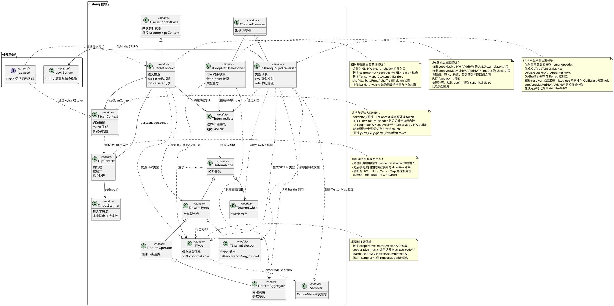
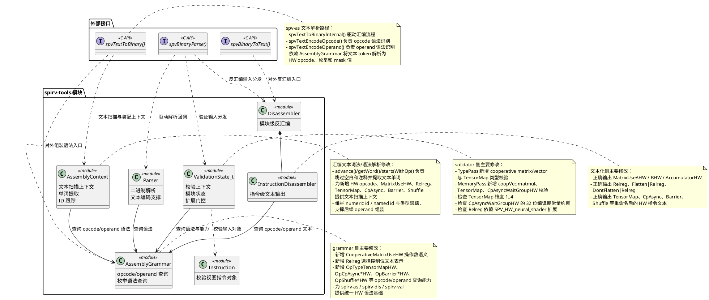
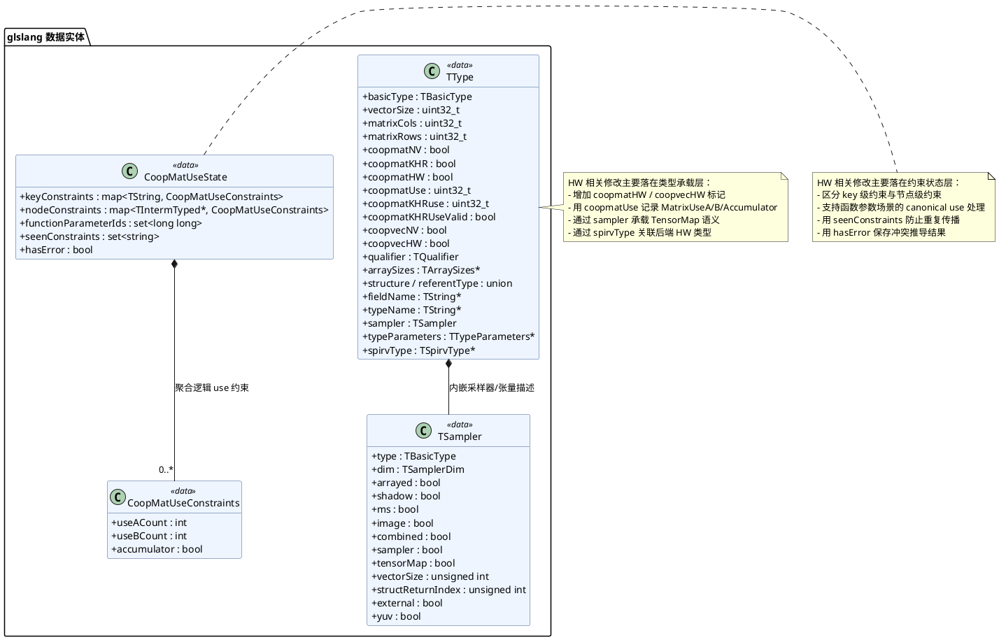
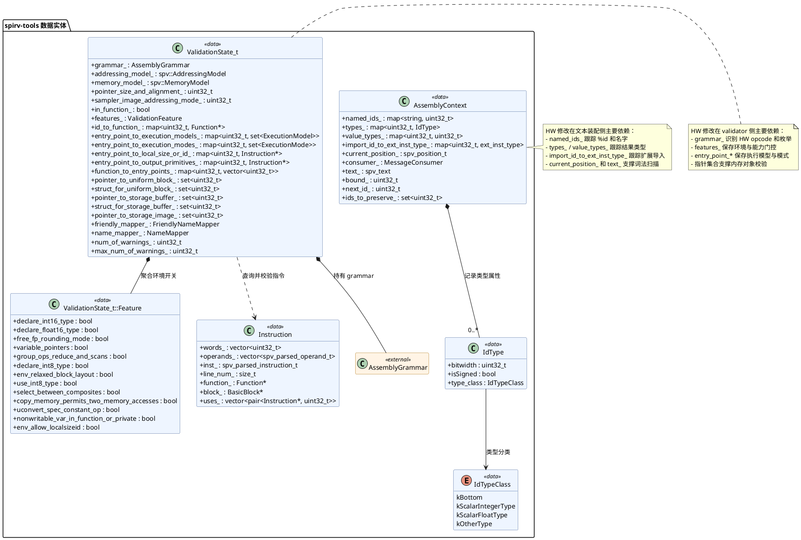

# HW 软件功能说明

## 1. 软件功能

### 1.1 适用范围

本文档描述当前分支相对于 `vulkan-sdk-1.4.309.0` 的 HW 修改所提供的软件功能，覆盖 `glslang` 与 SPIRV-Tools 工具链中的 `spirv-dis`、`spirv-as`、`spirv-val` 四个组件。功能范围不仅包括 cooperative matrix/vector 的新增与修正，还包括 `GL_HW_neural_shader` / `SPV_HW_neural_shader` 扩展统一、`TensorMap`、`CpAsync`、Barrier、HW shuffle builtins、`reg_control` 控制属性，以及与之配套的文本化、组装和合法性校验能力。

### 1.2 glslang

`glslang` 负责 HW 能力的前端语义承载和 SPIR-V 生成，是相对基线版本最主要的功能增量来源。该组件面向 GLSL 提供统一的扩展入口、类型系统和内建函数接口，并将其稳定映射到 HW neural shader 的 SPIR-V 表示。

其软件功能包括：

- 支持以 `GL_HW_neural_shader` 作为统一扩展入口，承载原 cooperative matrix 与 cooperative vector 相关能力，并向前端暴露统一的 HW neural shader 语义集合。
- 支持 `coopmatHW`、`coopvecHW` 等 HW cooperative 类型，以及与之对应的 load/store、乘法、乘加、reduce、conversion、bitcast 和 element-wise arithmetic 等操作。
- 支持 cooperative matrix 的矩形矩阵乘法场景和多阶段 shader 用法，使 HW matrix/vector 能力不再局限于单一计算形态。
- 支持 `coopMatLoadHW` / `coopMatStoreHW`、`coopVecLoadHW` / `coopVecStoreHW` 的参数解析与语义检查，包括 shape、offset、memory access 和相关对象类型约束。
- 支持 `coopMatMulHW`、`coopMatMulAddHW`、`coopVecMatMulHW`、`coopVecMatMulAddHW` 的参数匹配和维度检查，能够校验标量类型、行列关系、向量分量数和 bias 匹配关系，并对已修正的 vec-matmul 维度语义执行一致检查。
- 支持 cooperative matrix 角色推导，能够根据矩阵在矩阵乘、矩阵乘加、向量乘矩阵和返回值传播中的使用位置，推断 `MatrixUseAHW`、`MatrixUseBHW`、`MatrixAccumulatorHW`。
- 支持 cooperative matrix 逻辑角色在数组、链式表达式、函数参数、函数返回值和 mixed-use 场景中的传播与合并，确保 role 推导结果可以跨语句和跨函数稳定收敛。
- 支持 mixed-use 场景下的角色物化修正。当同一逻辑矩阵的最终推导角色与具体指令使用点要求不一致时，代码生成阶段能够自动插入 `OpBitcast`，从而保证 `coopMat` 和 `coopVec` 指令的矩阵操作数始终使用正确的 HW matrix use 类型。
- 支持 `tensorMap1D` 到 `tensorMap4D` 类型，以及 `cp_async_tensor_global_shared`、`cp_async_commit_group`、`cp_async_wait_group`、`barrier_arrive`、`barrier_wait` 等 HW 数据搬运与同步内建接口。
- 支持对 `cp_async_wait_group` 和 barrier 参数执行前端约束检查，包括编译期常量和非负值要求，避免不合法实参进入 SPIR-V 阶段。
- 支持 `shufidx`、`bytePrmt`、`shuffle_fill_down` 等 HW neural shader builtins，并对其参数范围和类型进行语义检查。
- 支持 `[[reg_control]]` 控制流属性，并允许与 `[[flatten]]`、`[[branch]]` 组合使用；在 SPIR-V 发射时能够将其转化为选择控制掩码中的 `Relreg` 语义位。
- 支持生成重命名后的 HW neural shader opcode、extension、builtin 常量和相关类型声明，使当前分支输出的 SPIR-V 文本与 HW 新命名体系保持一致。

从当前增量实现看，`glslang` 已不仅能够生成 HW cooperative matrix/vector 的基础类型和算术指令，还能够完整覆盖 role 推导、mixed-use cast 修正、TensorMap/CpAsync/Barrier 发射、HW shuffle 发射以及 `Relreg` 控制位生成等关键功能。

### 1.3 spirv-dis

`spirv-dis` 负责将包含 HW 扩展能力的 SPIR-V 二进制模块反汇编为可读文本，是检查前端输出、分析 mixed-use 结果和定位指令级问题的重要工具。

其软件功能包括：

- 支持对 HW cooperative matrix/vector 类型进行反汇编，能够输出 `OpTypeCooperativeMatrixHW`、`OpTypeCooperativeVectorHW` 及其相关类型信息。
- 支持在类型文本中展示 cooperative matrix 的 use 语义，能够清晰区分 `MatrixUseAHW`、`MatrixUseBHW`、`MatrixAccumulatorHW`。
- 支持对 cooperative matrix/vector 的 load/store、mul/muladd、reduce、conversion、bitcast 和算术指令进行标准文本化输出。
- 支持对 `OpTypeTensorMapHW`、`OpCpAsyncTensorGlobalSharedHW`、`OpCpAsyncCommitGroupHW`、`OpCpAsyncWaitGroupHW`、`OpBarrierArriveHW`、`OpBarrierWaitHW` 等 HW neural 指令进行反汇编展示。
- 支持对 `OpShuffleIndexHW`、`OpBytePermuteHW`、`OpShuffleFillDownHW` 等 HW builtin 指令进行可读输出。
- 支持对控制流中的 `Relreg` 选择控制位进行文本化展示，并正确显示 `Flatten|Relreg`、`DontFlatten|Relreg` 等组合形式。
- 支持在 mixed-use 场景中显示显式插入的 `OpBitcast`，使 cooperative matrix 的“逻辑角色”和“指令使用角色”之间的修正过程能够直接从反汇编结果中观察到。
- 支持使用重命名后的 HW neural shader 指令名和扩展名输出结果，保证当前工具链文本表示与相对基线后的新命名保持一致。

该组件提供的核心能力，是把 HW 模块中的类型、指令、角色和控制位信息稳定还原为可读文本，为人工审查和 golden 比对提供统一观察面。

### 1.4 spirv-as

`spirv-as` 负责将包含 HW 扩展语义的 SPIR-V 汇编文本重新组装为二进制模块，是 HW 文本用例构造、回归测试和反汇编闭环验证的关键组件。

其软件功能包括：

- 支持解析 `OpTypeCooperativeMatrixHW`、`OpTypeCooperativeVectorHW`、`OpTypeTensorMapHW` 等 HW 类型文本表示，并完成对应的二进制编码。
- 支持解析 cooperative matrix 的 use 枚举文本，能够正确组装 `MatrixUseAHW`、`MatrixUseBHW`、`MatrixAccumulatorHW`。
- 支持解析 cooperative matrix/vector 的 load/store、mul/muladd、reduce、conversion、bitcast 和算术指令文本，使 cooperative 计算链路可以直接通过汇编文本描述和复现。
- 支持解析 `OpCpAsyncTensorGlobalSharedHW`、`OpCpAsyncCommitGroupHW`、`OpCpAsyncWaitGroupHW`、`OpBarrierArriveHW`、`OpBarrierWaitHW` 等 HW 数据搬运与同步指令。
- 支持解析 `OpShuffleIndexHW`、`OpBytePermuteHW`、`OpShuffleFillDownHW` 等 HW builtin 指令。
- 支持解析控制流中的 `Relreg` 掩码位，并正确组装 `Relreg`、`Flatten|Relreg`、`DontFlatten|Relreg` 等选择控制写法。
- 支持组装 mixed-use 场景下包含显式 `OpBitcast` 的 cooperative matrix/vector 模块，使 role 推导后的使用点修正可以通过文本方式稳定复现。
- 支持与 `spirv-dis` 形成双向文本闭环，即对反汇编得到的 HW 模块文本再次组装时，能够保持类型、角色、控制位和指令语义的一致性。

该组件保证了 HW 模块在“文本表示”和“二进制表示”之间的双向可转换性，是用例维护、问题复现和跨工具链验证的基础能力。

### 1.5 spirv-val

`spirv-val` 负责对包含 HW 扩展能力的 SPIR-V 模块执行静态合法性校验，是相对基线新增 HW 语义的最终一致性约束组件。

其软件功能包括：

- 支持对 `SPV_HW_neural_shader` 扩展相关模块进行门控校验，确保 HW cooperative、TensorMap、CpAsync 以及 `Relreg` 控制位等能力只在声明相应扩展后使用。
- 支持校验 `OpTypeCooperativeMatrixHW` 的基础合法性，包括组件类型、行列常量要求以及 `MatrixUseAHW`、`MatrixUseBHW`、`MatrixAccumulatorHW` 枚举值范围。
- 支持校验 `OpTypeCooperativeVectorHW` 的组件类型与分量数约束。
- 支持校验 `OpTypeTensorMapHW` 的维度约束，确保 TensorMap 维度处于 1 到 4 的合法范围内。
- 支持校验 cooperative matrix/vector 的 load/store、mul/muladd、length、conversion、bitcast 及相关复合操作的类型匹配与对象约束。
- 支持校验 `OpCooperativeVectorMatrixMulHW` 与 `OpCooperativeVectorMatrixMulAddHW` 的结果向量、输入向量、矩阵和 bias 类型关系，检查组件类型、行列维度和分量数是否一致。
- 明确禁止在 `OpCooperativeVectorMatrixMulHW` 与 `OpCooperativeVectorMatrixMulAddHW` 的结果上使用 `NoContraction`；直接 decoration 和 decoration group 均按非法模块拒绝。
- 支持校验 `OpCpAsyncTensorGlobalSharedHW` 的操作数约束，包括目标地址必须指向 Workgroup 存储中的 32 位有符号整数数组、TensorMap 操作数必须为 `OpTypeTensorMapHW`、维度必须与坐标类型匹配。
- 支持校验 `OpCpAsyncWaitGroupHW` 的参数约束，确保 `N` 为 32 位整数编译期常量，且取值非负。
- 支持校验 `Relreg` 选择控制位的扩展依赖关系，保证该控制位仅在 HW neural shader 扩展启用时合法使用。

该组件的核心价值在于把当前分支新增的 HW 类型、指令、控制位和参数约束收敛为可执行的静态验证规则，使不满足 HW 规范的模块能够在执行前被明确拦截。

### 1.6 功能协同关系

相对于 `vulkan-sdk-1.4.309.0`，上述四个组件共同构成了完整的 HW 软件处理链路：

- `glslang` 负责提供 GLSL 层的 HW 扩展接口和 SPIR-V 生成能力。
- `spirv-dis` 负责将生成结果还原为可读文本，暴露类型、角色、控制位和指令细节。
- `spirv-as` 负责将 HW 汇编文本重新组装为二进制模块，形成文本闭环。
- `spirv-val` 负责对最终模块执行扩展门控、类型匹配和参数约束校验。

通过上述分工，当前分支已经能够完成从 HW 前端语义输入、到 SPIR-V 生成、到文本观察、再到静态合法性确认的完整闭环，满足相对于 `vulkan-sdk-1.4.309.0` 的全部 HW 修改的软件功能描述需求。

## 2. 模块设计描述

### 2.1 模块总体结构

为支持相对于 `vulkan-sdk-1.4.309.0` 的全部 HW 修改，整体设计没有把能力集中到单一类中，而是按照职责分解为两个相互衔接的模块簇：`glslang` 侧负责“预处理/词法解析 + 语法/语义分析 + 中间表示承载 + SPIR-V 生成”，`spirv-tools` 侧负责“语法查询 + 汇编文本词法/语法解析 + 汇编/反汇编转换 + 静态合法性校验”。这种分解方式可以将 HW 扩展语义的引入控制在各自最合适的抽象层，避免词法与语法识别、前端语义、二进制表示和验证规则彼此耦合。

从类之间的协作关系看，`glslang` 先由 `TInputScanner`、`TPpContext`、`TScanContext` 和 `yyparse()` 完成字符流读取、预处理、词法切分和语法归约，再由 `TParseContext` 完成内建函数和类型语义检查，通过 `TIntermediate`、`TInterm*` 和 `TType` 持有语义树与类型信息；在 SPIR-V 发射前，`TCoopMatUseResolver` 会对 cooperative matrix 的 logical use 约束执行收集、传播、定型和类型重写，最后再由 `TGlslangToSpvTraverser` 遍历 IR 并调用 `spv::Builder` 发射 SPIR-V；`spirv-tools` 则以 `AssemblyGrammar` 作为公共语法支点，为 `spirv-as`、`spirv-dis` 和 `spirv-val` 提供统一的 opcode 与 operand 查询能力，其中汇编文本路径由 `AssemblyContext` 负责词法扫描和文本装配上下文管理，并分别由 `Parser`、`Disassembler`、`InstructionDisassembler`、`ValidationState_t` 和 `Instruction` 完成文本转换与规则校验。

以下类图仅绘制本次 HW 修改直接涉及的核心类、关键公共基类和外部依赖。其中，本模块类与其他模块依赖在图中分包表示，以突出模块内部职责边界与跨模块调用关系。

#### 2.1.1 glslang 模块总体结构

`glslang` 模块按“预处理层、词法层、语法/语义层、中间表示层、role 解析层、SPIR-V 生成层”进行分解。预处理层负责宏展开、指令处理和输入拼接；词法层负责把预处理输出转换为 GLSL token；语法/语义层负责识别 `GL_HW_neural_shader` 扩展、校验 cooperative matrix/vector、TensorMap、CpAsync、Barrier、shuffle 和 `reg_control` 等语义；中间表示层负责保存 HW 类型、表达式和控制流节点；role 解析层负责在 lowering 前统一解析 cooperative matrix 的 UseA/UseB/Accumulator 约束；SPIR-V 生成层负责读取类型和节点信息，完成 HW opcode、matrix use、TensorMap 和 `Relreg` 等表示的最终发射。

图中各类的职责如下：

- `TParseContextBase`：负责保存共享解析状态，并把预处理器和扫描器上下文挂接到具体解析流程中，是词法、语法和语义阶段的公共基座。
- `TPpContext`、`TInputScanner`、`TScanContext` 与 `yyparse()`：共同构成源码的预处理、词法和语法解析链路。其中 `TInputScanner` 读取多段输入字符流，`TPpContext` 执行预处理与宏展开，`TScanContext` 负责 token 化和关键字门控，`yyparse()` 负责语法归约并驱动语义动作。
- `TParseContext`：负责 HW 扩展入口识别、内建函数参数检查、维度匹配检查，以及 cooperative matrix logical use 的记录，是前端语义约束的核心入口。
- `TIntermediate`：负责承载语义分析后的 AST/IR，向后续遍历和 SPIR-V 生成阶段提供统一访问入口。
- `TIntermNode`、`TIntermTyped`、`TIntermOperator`、`TIntermAggregate`、`TIntermSelection`、`TIntermSwitch`：负责表达 HW 相关调用、表达式与控制流结构，其中 `TIntermAggregate` 主要承载 cooperative、TensorMap、CpAsync 和 shuffle 等内建调用节点。
- `TType`、`TSampler`：负责保存 cooperative matrix/vector、TensorMap 等 HW 类型属性，其中 `TType` 还承载 cooperative matrix role 推导结果。
- `TCoopMatUseResolver`：负责在 lowering 前对 cooperative matrix use 约束进行统一解析，包括直接约束收集、固定点传播、冲突处理、默认角色补全和类型重写，是 cooperative matrix role 语义从“逻辑使用”变成“发射类型”的关键中间层。
- `TGlslangToSpvTraverser`：负责遍历 IR、读取类型与控制流属性、生成 HW opcode，并根据 resolver 已写回的 role 信息在 mixed-use 场景插入 `OpBitcast` 等物化修正。
- `spv::Builder`：属于下游 SPIR-V 构造依赖，不参与前端语义判断，但承担最终类型和指令落地工作。

该结构体现了 `glslang` 模块的核心协作路径：`TInputScanner` 提供字符流，`TPpContext` 完成预处理，`TScanContext` 负责词法切分并通过 `yyparse()` 触发语法归约，`TParseContext` 在归约过程中执行语义检查并生成 `TIntermediate`；随后 `TCoopMatUseResolver` 对 cooperative matrix logical use 进行多轮收集与传播并重写类型，最后 `TGlslangToSpvTraverser` 读取 `TInterm*` 与 `TType` 中已经定型的 HW 语义信息，并通过 `spv::Builder` 输出最终的 HW neural shader SPIR-V 模块。

#### 2.1.2 spirv-tools 模块总体结构

`spirv-tools` 模块按“语法查询层、汇编文本词法/语法解析层、汇编/反汇编处理层、静态验证层”进行分解。语法查询层负责维护 opcode、operand 和枚举值的统一查询能力；汇编文本词法/语法解析层负责对文本流执行分词、opcode/operand 识别和指令装配；汇编/反汇编处理层分别负责文本到二进制、二进制到文本的转换；静态验证层负责在统一语法上下文中检查 HW 类型、HW 指令、TensorMap、CpAsync 和 `Relreg` 等规则是否合法。

图中各类的职责如下：

- `AssemblyGrammar`：负责维护 SPIR-V opcode、operand 和枚举语法表，是 `spirv-as`、`spirv-dis` 和 `spirv-val` 的共同基础依赖。
- `AssemblyContext`：负责在 `spirv-as` 文本路径中维护当前位置、扫描单词、识别新指令起点、跟踪命名 ID 和数值 ID，是汇编文本词法解析与指令装配的上下文载体。
- `Parser`：负责按 grammar 解析二进制 SPIR-V 模块，是底层汇编/解析流程的内部支撑类。
- `Disassembler`：负责模块级反汇编流程控制，包括头信息输出、指令遍历和文本结果组织。
- `InstructionDisassembler`：负责单条指令和单个 operand 的文本化输出，是 `spirv-dis` 能正确展示 `MatrixUseBHW`、`Relreg`、`OpTypeTensorMapHW` 等 HW 语义的直接执行类。
- `ValidationState_t`：负责保存模块状态、目标环境、扩展能力和 grammar 引用，是 `spirv-val` 各类校验规则共享的状态容器。
- `Instruction`：负责为 validator 提供统一的指令视图，使 `TypePass`、`MemoryPass` 等规则可以在统一接口上检查 HW 类型和操作数。
- `spvBinaryParse()`、`spvBinaryToText()`、`spvTextToBinary()`：属于对外 C API 入口，用于把工具内部类能力暴露给外部调用者；其中 `spvTextToBinary()` 通过 `AssemblyContext` 以及 `spvTextEncodeOpcode()`、`spvTextEncodeOperand()` 形成汇编文本的词法与语法解析链路。

该结构体现了 `spirv-tools` 模块的核心协作路径：`AssemblyGrammar` 先提供统一的 opcode/operand 语义查询能力，在文本汇编路径中由 `AssemblyContext` 负责词法扫描，并配合 `spvTextEncodeOpcode()`、`spvTextEncodeOperand()` 完成语法解析与指令装配；在反汇编路径中由 `Disassembler` 与 `InstructionDisassembler` 负责文本输出；在验证路径中由 `ValidationState_t` 联合 `Instruction` 以及 `TypePass`、`MemoryPass` 等验证流程对 HW neural shader 模块执行静态校验。

### 2.2 数据实体描述

本节从数据组织角度说明 HW 修改涉及的主要数据实体。`2.1` 已经描述了词法分析、语法分析、语义检查、SPIR-V 生成以及汇编/反汇编/校验等控制类的协作方式；本节进一步说明这些流程在执行过程中依赖哪些核心数据对象，以及这些对象如何承载 cooperative matrix/vector、TensorMap、文本装配状态和验证状态。对于体量较大的基础类，仅列出与当前 HW 修改直接相关或直接影响 HW 功能实现的关键成员。

#### 2.2.1 glslang 数据实体

`glslang` 的 HW 修改主要依赖两类数据实体：一类是类型数据，负责承载 cooperative matrix/vector、TensorMap 以及相关限定信息；另一类是逻辑 use 推导状态数据，负责记录 cooperative matrix 在遍历期间被当作 `UseA`、`UseB` 还是 `Accumulator` 使用。前者由 `TType` 和 `TSampler` 承载，后者由 `CoopMatUseConstraints` 与 `CoopMatUseState` 承载。

##### `TType`

作用：`TType` 是 `glslang` 中最核心的类型实体，负责承载标量、向量、矩阵、结构体、采样器以及 cooperative matrix/vector 等扩展类型信息。HW 修改主要通过该类记录 `coopmatHW`、`coopvecHW`、`coopmatUse` 以及 TensorMap 相关类型状态。

成员说明：
- `basicType`：记录类型的基础标量类别，例如整型、浮点型、布尔型或采样器型。
- `vectorSize`：记录向量宽度，供 cooperative vector 和普通向量类型共用。
- `matrixCols`：记录矩阵列数，用于 cooperative matrix 形状描述和维度检查。
- `matrixRows`：记录矩阵行数，用于 cooperative matrix 形状描述和维度检查。
- `coopmatNV`：标记当前类型是否属于 NV cooperative matrix 体系。
- `coopmatKHR`：标记当前类型是否属于 KHR cooperative matrix 体系。
- `coopmatHW`：标记当前类型是否属于 HW cooperative matrix 体系，是本次 HW 修改的核心标志位。
- `coopmatUse`：记录 HW cooperative matrix 的逻辑角色，取值对应 `UseA`、`UseB` 或 `Accumulator`。
- `coopmatKHRuse`：记录 KHR cooperative matrix 的 use 语义，与 HW 路径相互独立。
- `coopmatKHRUseValid`：标记 `coopmatKHRuse` 是否有效，避免未初始化的 use 被误用。
- `coopvecNV`：标记当前类型是否属于 NV cooperative vector 体系。
- `coopvecHW`：标记当前类型是否属于 HW cooperative vector 体系，是 HW vec 指令类型检查的依据。
- `qualifier`：记录存储类、布局限定、精度和扩展门控等限定信息，HW 内建类型和内建函数的语义检查会依赖该字段。
- `arraySizes`：记录数组维度信息，供 cooperative matrix/vector 的数组场景和参数检查使用。
- `structure / referentType`：结构体类型时指向字段列表，别名或引用型场景时指向被引用类型，用于复合类型展开。
- `fieldName`：记录结构体字段名或局部字段名，支持结构体字段语义和调试输出。
- `typeName`：记录类型名或结构体名，支持类型别名、错误诊断和 SPIR-V 类型命名。
- `sampler`：内嵌 `TSampler` 数据，用于承载采样器、图像以及 TensorMap 的维度和属性。
- `typeParameters`：记录参数化类型的补充信息，供部分扩展类型和模板化语义路径使用。
- `spirvType`：缓存后端 SPIR-V 类型关联结果，便于在 lowering 阶段复用已构造的类型信息。

实体关系：`TType` 内嵌 `TSampler` 以复用现有采样器类型描述；同时它还是 `TIntermTyped` 节点、`TCoopMatUseResolver` 和 `TGlslangToSpvTraverser` 共享的类型载体。

##### `TSampler`

作用：`TSampler` 用于承载采样器、图像以及 TensorMap 类型的细粒度属性。HW 修改中，TensorMap 的类型识别和维度传递依赖该实体中的 `tensorMap`、`dim` 和基础类型字段。

成员说明：
- `type`：记录底层元素类型，例如 `float16`、`float32` 或整型元素类型。
- `dim`：记录对象维度，例如 1D、2D、3D 或 Buffer，是 TensorMap 维度校验的直接来源。
- `arrayed`：标记对象是否为数组化资源。
- `shadow`：标记对象是否带阴影比较语义。
- `ms`：标记对象是否为多重采样资源。
- `image`：标记对象是否为 image 类型。
- `combined`：标记对象是否为 combined image-sampler 类型。
- `sampler`：标记对象是否具备 sampler 语义。
- `tensorMap`：标记当前采样器描述是否用于 HW TensorMap，是本次 HW 修改的核心标志位。
- `vectorSize`：记录向量返回宽度或相关聚合宽度信息，供部分复合资源场景复用。
- `structReturnIndex`：记录结构体返回场景下的成员索引，便于在复杂返回类型中定位资源成员。
- `external`：标记对象是否为外部资源。
- `yuv`：标记对象是否带有 YUV 相关语义。

实体关系：`TSampler` 作为 `TType` 的内嵌成员存在，不单独在 AST 中流动，而是通过 `TType` 参与类型判定、TensorMap 语义检查和后端 SPIR-V 类型发射。

##### `CoopMatUseConstraints`

作用：`CoopMatUseConstraints` 是 cooperative matrix 逻辑角色推导过程中最小粒度的约束单元，用于累计某个矩阵值被当作 `UseA`、`UseB` 或 `Accumulator` 使用的次数和状态。

成员说明：
- `useACount`：记录当前矩阵值被识别为左矩阵操作数的次数。
- `useBCount`：记录当前矩阵值被识别为右矩阵操作数的次数。
- `accumulator`：记录当前矩阵值是否在任一路径中被识别为累加器。

实体关系：该实体既可被 `CoopMatUseState.keyConstraints` 按逻辑 key 聚合，也可被 `CoopMatUseState.nodeConstraints` 按具体 `TIntermTyped*` 节点聚合。

##### `CoopMatUseState`

作用：`CoopMatUseState` 用于保存 `TCoopMatUseResolver` 在多轮遍历中的全部中间状态，是 cooperative matrix role 推导、传播、冲突检测和类型重写的状态总表。

成员说明：
- `keyConstraints`：按逻辑 key 保存约束，主要用于在数组、结构体字段和跨节点引用场景中合并同一矩阵对象的 use 统计。
- `nodeConstraints`：按 `TIntermTyped*` 节点保存约束，主要用于精确回写单个 AST 节点的推导结果。
- `functionParameterIds`：记录函数参数对应的标识，用于参数场景下的 canonical use 处理和传播边界控制。
- `seenConstraints`：记录已经传播过的约束路径，避免在 fixed-point 迭代中重复处理相同约束。
- `hasError`：记录推导过程中是否出现无法接受的冲突或错误状态，供上层流程统一报错。

实体关系：`CoopMatUseState` 聚合多个 `CoopMatUseConstraints`，并由 `TCoopMatUseResolver` 统一维护；其结果最终会反映到 `TType.coopmatUse` 中。

#### 2.2.2 spirv-tools 数据实体

`spirv-tools` 的 HW 修改主要依赖三类数据实体：第一类是文本装配状态数据，用于 `spirv-as` 解析 `%id`、类型和扩展指令；第二类是验证状态数据，用于 `spirv-val` 保存目标环境、扩展开关和模块级关联信息；第三类是指令视图数据，用于在统一表示上执行类型校验和内存校验。相应的核心实体包括 `IdTypeClass`、`IdType`、`AssemblyContext`、`ValidationState_t::Feature`、`ValidationState_t` 和 `Instruction`。

##### `IdTypeClass`

作用：`IdTypeClass` 是 `spirv-as` 文本路径中的轻量类型分类枚举，用于区分数值 ID 对应的是整型标量、浮点标量还是其他类型，便于在解析立即数、扩展操作数和常量时进行快速分派。

成员说明：
- `kBottom`：表示尚未建立有效类型分类，通常用于初始状态或未知状态。
- `kScalarIntegerType`：表示该 ID 对应的类型是标量整数类型。
- `kScalarFloatType`：表示该 ID 对应的类型是标量浮点类型。
- `kOtherType`：表示该 ID 对应的类型不属于前述两类，通常是复合类型或其他特殊类型。

实体关系：`IdTypeClass` 被 `IdType.type_class` 引用，用作汇编文本语法分析过程中的基础分类标签。

##### `IdType`

作用：`IdType` 用于保存单个类型 ID 的最小必要语义，是 `AssemblyContext.types_` 表中用于辅助文本组装的轻量类型记录。

成员说明：
- `bitwidth`：记录该类型的位宽，例如 16 位、32 位或 64 位。
- `isSigned`：记录整数类型是否为有符号类型；对浮点类型通常不参与判断。
- `type_class`：记录该类型属于哪一类，取值来自 `IdTypeClass`。

实体关系：`IdType` 由 `AssemblyContext.types_` 按类型 ID 管理，并与 `value_types_` 一起支撑 operand 解析、常量编码和扩展操作数检查。

##### `AssemblyContext`

作用：`AssemblyContext` 是 `spirv-as` 在文本汇编路径上的核心状态实体，用于承载词法扫描位置、名称到数值 ID 的映射、结果 ID 的类型信息以及扩展导入状态。HW neural shader 扩展的 opcode、enum 和 operand 解析都依赖该实体中的上下文数据。

成员说明：
- `named_ids_`：保存文本名字到数值 ID 的映射，用于解析 `%name` 形式的引用。
- `types_`：保存类型 ID 到 `IdType` 的映射，用于记录基础类型位宽、符号和分类信息。
- `value_types_`：保存结果 ID 到类型 ID 的映射，用于在解析操作数时反查结果值的类型。
- `import_id_to_ext_inst_type_`：保存扩展导入 ID 到扩展类型的映射，用于扩展指令解析。
- `current_position_`：记录当前词法扫描位置，包括行号、列号和索引，用于错误报告和继续扫描。
- `consumer_`：记录消息消费器，用于上报词法错误、语法错误和组装错误。
- `text_`：保存当前待解析的文本对象，是词法扫描的数据源。
- `bound_`：保存当前模块的 ID 上界。
- `next_id_`：保存自动分配新 ID 时的下一个可用值。
- `ids_to_preserve_`：记录需要保留原始数值的 ID 集合，用于 round-trip 或指定 ID 场景。

实体关系：`AssemblyContext` 聚合 `IdType` 和多种 ID 映射表，并被 `spvTextToBinaryInternal()`、`spvTextEncodeOpcode()`、`spvTextEncodeOperand()` 共同使用。

##### `ValidationState_t::Feature`

作用：`ValidationState_t::Feature` 用于保存 validator 在当前目标环境下允许使用的语言能力、布局规则和历史兼容开关。HW neural shader 相关规则虽然主要由扩展门控控制，但仍需依赖这些布尔开关来判断基础类型能力和环境放宽条件。

成员说明：
- `declare_int16_type`：表示是否允许声明 16 位整数类型。
- `declare_float16_type`：表示是否允许声明 16 位浮点类型。
- `free_fp_rounding_mode`：表示是否允许更自由的浮点舍入模式使用。
- `variable_pointers`：表示是否允许变量指针能力相关语义。
- `group_ops_reduce_and_scans`：表示是否允许相关 group operation 能力。
- `declare_int8_type`：表示是否允许声明 8 位整数类型。
- `env_relaxed_block_layout`：表示目标环境是否允许更宽松的 block layout 规则。
- `use_int8_type`：表示是否允许在指令和对象中实际使用 8 位整数类型。
- `select_between_composites`：表示是否允许在 `OpSelect` 等路径上操作复合类型。
- `copy_memory_permits_two_memory_accesses`：表示目标环境是否允许 `OpCopyMemory` 带两个 memory access。
- `uconvert_spec_constant_op`：表示是否允许 `OpUConvert` 用于 spec constant 相关场景。
- `nonwritable_var_in_function_or_private`：表示是否允许特定存储类中的非可写变量限制放宽。
- `env_allow_localsizeid`：表示目标环境是否允许 `LocalSizeId` 相关语义。

实体关系：该实体由 `ValidationState_t.features_` 聚合，供各个 validator pass 在进行类型、布局、执行模式和内存规则判断时共享。

##### `ValidationState_t`

作用：`ValidationState_t` 是 `spirv-val` 的中心状态实体，负责保存整个模块的 grammar、环境、入口点、函数、类型和资源对象关联信息。HW 类型、HW 指令以及 TensorMap/CpAsync/Barrier 等扩展对象的合法性校验都依赖该实体中的状态。

成员说明：
- `grammar_`：保存当前目标环境下的 SPIR-V grammar，是识别 HW opcode、operand 和枚举语义的基础。
- `addressing_model_`：记录模块声明的 addressing model。
- `memory_model_`：记录模块声明的 memory model。
- `pointer_size_and_alignment_`：记录目标指针大小和对齐约束，供内存对象校验使用。
- `sampler_image_addressing_mode_`：记录采样器和图像对象的寻址模式约束。
- `in_function_`：记录当前验证过程是否位于函数体内，影响部分指令的上下文合法性。
- `features_`：聚合目标环境开关和兼容性能力，供各类校验规则共享。
- `id_to_function_`：保存函数 ID 到函数对象的映射，供跨函数校验和入口点追踪使用。
- `entry_point_to_execution_models_`：保存入口点到执行模型集合的映射。
- `entry_point_to_execution_modes_`：保存入口点到执行模式集合的映射。
- `entry_point_to_local_size_or_id_`：保存入口点关联的 `LocalSize` 或 `LocalSizeId` 指令信息。
- `entry_point_to_output_primitives_`：保存入口点关联的输出 primitive 信息。
- `function_to_entry_points_`：保存函数到入口点集合的反向映射，便于从函数反查可达入口点。
- `pointer_to_uniform_block_`：记录指向 uniform block 的指针类型 ID 集合。
- `struct_for_uniform_block_`：记录被认定为 uniform block 的结构体类型 ID 集合。
- `pointer_to_storage_buffer_`：记录指向 storage buffer 的指针类型 ID 集合。
- `struct_for_storage_buffer_`：记录被认定为 storage buffer 的结构体类型 ID 集合。
- `pointer_to_storage_image_`：记录指向 storage image 的对象 ID 集合。
- `friendly_mapper_`：保存友好名称映射器，用于更易读的诊断输出。
- `name_mapper_`：保存通用名称映射器，用于将 ID 转换为可输出名称。
- `num_of_warnings_`：记录当前已经产生的 warning 数量。
- `max_num_of_warnings_`：记录允许输出的 warning 上限。

实体关系：`ValidationState_t` 聚合 `ValidationState_t::Feature` 与 `AssemblyGrammar`，并在各个 validator pass 中与 `Instruction` 协同工作；其中 `TypePass`、`MemoryPass`、`ValidationState_t` 共享同一份模块级状态。

##### `Instruction`

作用：`Instruction` 是 `spirv-val` 中对单条 SPIR-V 指令的统一数据视图，负责向各类验证规则提供结果类型、操作数、所属函数和 use-def 关系等信息。HW cooperative matrix/vector、TensorMap、CpAsync 和 Barrier 校验都在该视图之上进行。

成员说明：
- `words_`：保存指令的原始字流，是最底层的编码表示。
- `operands_`：保存已经解析好的操作数表，供类型校验和语义校验直接访问。
- `inst_`：保存原始解析得到的指令元信息，包括 opcode、字数和回调数据。
- `line_num_`：保存该指令在输入流中的行号，便于定位错误。
- `function_`：记录该指令所属函数对象。
- `block_`：记录该指令所属基本块对象。
- `uses_`：记录该指令结果被哪些其他指令使用以及被使用的操作数位置，是 use-def 校验和传播的重要数据基础。

实体关系：`Instruction` 被 `ValidationState_t` 和各个 validator pass 共享使用；同时它通过 `function_` 和 `block_` 与更高层的函数、基本块结构关联。

### 2.3 接口函数描述

本节用于描述 HW 修改链路上的核心控制函数和关键辅助函数。由于当前模块不涉及数据库表，`Data Accessed` 和 `Data Updated` 中的“数据”统一描述为源码中的全局状态、上下文对象、AST/IR、类型表、grammar 表和验证状态对象。

#### 2.3.1 glslang 接口函数

##### `TParseContext::parseShaderStrings`

Function: `bool TParseContext::parseShaderStrings(TPpContext& ppContext, TInputScanner& input, bool versionWillBeError)`  
Description: `glslang` 的解析总入口，负责把输入字符串接入预处理器和扫描器，并调用语法分析流程完成 HW neural shader 源码的整体解析；按整份 shader 调用一次，时间开销与源码规模成正比。  
Calls: `TPpContext::setInput()`, `yyparse()`, `finish()`  
Data Accessed: `currentScanner`, `numErrors`, `TPpContext` 预处理状态, `TInputScanner` 输入流  
Data Updated: `currentScanner`, `TIntermediate` 中的 AST/IR, 诊断信息计数  
Input: `ppContext` 为预处理上下文；`input` 为待解析源码输入流；`versionWillBeError` 指示版本声明问题是否按错误处理。  
Output: 无输出参数；解析结果以 `TIntermediate` 和诊断状态的形式保存在 `TParseContext` 内部。  
Return: `true` 表示解析结束且 `numErrors == 0`；`false` 表示存在语法或语义错误。  
Others: 该函数是 `yyparse()` 的直接调用者，也是词法、语法、语义和 HW 扩展检查的统一入口。

##### `TScanContext::tokenize`

Function: `int TScanContext::tokenize(TPpContext* pp, TParserToken& token)`  
Description: 词法分析入口，从预处理输出中逐个读取 token，并将其转换为 Bison 语法分析器可消费的终结符；会识别 `coopmatHW`、`coopvecHW`、`tensorMap1D..4D` 等 HW 关键字。  
Calls: `TPpContext::tokenize()`, `tokenizeIdentifier()`, `parseContext.error()`, `NewPoolTString()`  
Data Accessed: `parserToken`, `tokenText`, `loc`, `afterType`, `afterBuffer`, `afterStruct`, `field`, 关键字映射表  
Data Updated: `parserToken`, `tokenText`, `loc`, `afterType`, `afterBuffer`, `afterStruct`, `field`, 输出参数 `token`  
Input: `pp` 为预处理 token 来源；`token` 为待填充的语法 token 对象，两者必须配套使用。  
Output: `token` 中写入词法类别、字面量值和源码位置。  
Return: 返回语法分析器使用的 token 编号；返回 `0` 表示到达输入结尾。  
Others: 该函数被 `yylex()`/`yyparse()` 高频调用，属于整个前端最热的路径之一。

##### `TParseContext::typeParametersCheck`

Function: `void TParseContext::typeParametersCheck(const TSourceLoc& loc, const TPublicType& publicType)`  
Description: 对带类型参数的扩展类型执行额外检查；对 HW 修改而言，主要负责校验 `coopmatHW` 的基础元素类型与二维 shape 参数，以及相关扩展类型的参数维度合法性。  
Calls: `error()`, `warn()`, `TType::getBasicString()`  
Data Accessed: `parsingBuiltins`, `publicType.qualifier`, `publicType.typeParameters`, `publicType.typeParameters->arraySizes`  
Data Updated: 诊断信息；在张量布局兼容路径下可能补齐 `typeParameters->arraySizes` 的缺省维度  
Input: `loc` 为报错位置；`publicType` 为正在构造的公开类型描述，要求已带上基础类型和类型参数。  
Output: 无输出参数；检查结果通过诊断和 `publicType` 内部可变对象体现。  
Return: 无返回值。  
Others: 该函数在类型构造阶段执行，早于 AST lowering，可阻止非法的 `coopmatHW<type, rows, cols>` 类型进入后续阶段。

##### `TParseContext::builtInOpCheck`

Function: `void TParseContext::builtInOpCheck(const TSourceLoc& loc, const TFunction& fnCandidate, TIntermOperator& callNode)`  
Description: 对已经完成原型匹配的内建函数调用执行补充语义检查；HW 修改中，该函数覆盖 `coopVecMatMulHW`、`coopMatMulHW`、`cp_async_tensor_global_shared`、`cp_async_wait_group`、`barrier_arrive`、`barrier_wait`、`shuffle` 等语义。  
Calls: `handleCoopVecHWMatMulBuiltin()`, `handleCoopMatHWMultiplyBuiltin()`, `memorySemanticsCheck()`, `getConstantIntValue()`, `error()`, `requireExtensions()`  
Data Accessed: `callNode` 的参数序列与参数类型, `fnCandidate` 的 builtin 操作码和参数定义, 当前扩展/版本状态  
Data Updated: 诊断信息；通过被调辅助函数间接更新 cooperative matrix 的 logical use 记录  
Input: `loc` 为调用位置；`fnCandidate` 为已经匹配成功的内建函数原型；`callNode` 为对应的调用节点。  
Output: 无输出参数；必要时会在 `callNode` 对应的上下文上产生错误或警告。  
Return: 无返回值。  
Others: 该函数假定“普通参数类型检查”已经完成，专门处理原型系统无法表达的 HW 约束，例如 TensorMap 维度匹配和编译期常量要求。

##### `TParseContext::recordCoopMatHWLogicalValueUse`

Function: `void TParseContext::recordCoopMatHWLogicalValueUse(const TSourceLoc& loc, TIntermTyped* node, bool accumulator, const char* token)`  
Description: 在前端语义阶段记录 cooperative matrix 逻辑值的直接使用角色，并在同一逻辑值同时被当作 `OperandAB` 与 `Accumulator` 使用时立即报错。  
Calls: `getCoopMatHWLogicalValueKey()`, `error()`  
Data Accessed: `node->getType()`, `coopMatHWLogicalValueRoles`  
Data Updated: `coopMatHWLogicalValueRoles`, 诊断信息  
Input: `loc` 为错误定位；`node` 为参与乘法或乘加的 cooperative matrix AST 节点；`accumulator` 指示当前使用是否为累加器角色；`token` 为报错时显示的内建函数名。  
Output: 无输出参数。  
Return: 无返回值。  
Others: 该函数为后续 `TCoopMatUseResolver` 提供早期冲突防护，主要由 `handleCoopMatHWMultiplyBuiltin()` 触发。

##### `TCoopMatUseResolver::visitAggregate`

Function: `bool TCoopMatUseResolver::visitAggregate(glslang::TVisit visit, glslang::TIntermAggregate* node)`  
Description: cooperative matrix role 推导的核心遍历回调，在后序访问阶段收集 HW matmul/vecmatmul 的直接约束、记录函数参数、传播 use，并按需要重写节点类型。  
Calls: `constrain()`, `propagateSameUse()`, `propagateGeneratedOutputTempUse()`, `defaultUsePreservingExpression()`, `rewriteType()`  
Data Accessed: `node->getOp()`, `node->getSequence()`, `state.keyConstraints`, `state.nodeConstraints`, `state.functionParameterIds`  
Data Updated: `state.keyConstraints`, `state.nodeConstraints`, `state.functionParameterIds`, AST 节点上的 `TType.coopmatUse`  
Input: `visit` 为遍历阶段标志；`node` 为当前 aggregate 节点，可能是函数、构造、`coopMatMulHW`、`coopVecMatMulAddHW` 等操作。  
Output: 无输出参数；约束状态和节点类型被直接写回 `state` 与 AST。  
Return: 返回 `true` 以继续遍历。  
Others: 对 `coopVecMatMulHW` 和 `coopVecMatMulAddHW`，该函数会把 matrix 操作数直接约束为 `UseB`；最终角色定型和 tie-break 由其内部调用链上的 `resolve()` 完成。

##### `createCooperativeMatrixHWUseCast`

Function: `spv::Id createCooperativeMatrixHWUseCast(spv::Builder& builder, spv::Id object, spv::CooperativeMatrixUseHW use)`  
Description: 在 SPIR-V 发射阶段把 cooperative matrix 值物化为指定的 HW use 类型；如果源类型与目标 use 不一致，则显式插入 `OpBitcast`。  
Calls: `spv::Builder::getTypeId()`, `spv::Builder::isCooperativeMatrixHWType()`, `spv::Builder::makeCooperativeMatrixTypeHW()`, `spv::Builder::createUnaryOp()`  
Data Accessed: `builder` 中的类型表, `object` 对应的当前类型 ID  
Data Updated: `builder` 内部的类型缓存和指令流  
Input: `builder` 为 SPIR-V 构造器；`object` 为待转换对象 ID；`use` 为目标矩阵角色，通常为 `MatrixUseAHW`、`MatrixUseBHW` 或 `AccumulatorHW`。  
Output: 无输出参数。  
Return: 若无需转换则返回原 `object`；若需要转换则返回新生成的 `OpBitcast` 结果 ID。  
Others: 该函数是 mixed-use 修正的关键实现点，同时被 cooperative matrix 和 cooperative vector 的 HW 发射函数复用。

##### `createCooperativeVectorHWMatMulAdd`

Function: `spv::Id createCooperativeVectorHWMatMulAdd(spv::Builder& builder, spv::Id typeId, const std::vector<spv::Id>& operands)`  
Description: 生成 `OpCooperativeVectorMatrixMulAddHW` 指令，并在发射前强制把 matrix 操作数转换为 `MatrixUseBHW`，保证 vec-matmul 使用点的 role 物化正确。  
Calls: `createCooperativeMatrixHWUseCast()`, `spv::Builder::createOp()`  
Data Accessed: `operands[1]` 输入向量, `operands[2]` 矩阵对象, `operands[3]` bias 向量, `builder` 的类型与指令状态  
Data Updated: `builder` 指令流, `builder` 中可能新增的 cooperative matrix use 类型  
Input: `builder` 为 SPIR-V 构造器；`typeId` 为结果 cooperative vector 类型；`operands` 按 lowering 约定包含输入、矩阵和 bias 对象 ID。  
Output: 无输出参数。  
Return: 返回新建 `OpCooperativeVectorMatrixMulAddHW` 指令的结果 ID。  
Others: `createCooperativeVectorHWMatMul()` 是其无 bias 对应版本，矩阵操作数同样通过该函数族强制修正为 `UseB`。

#### 2.3.2 spirv-tools 接口函数

##### `spvTextEncodeOpcode`

Function: `spv_result_t spvTextEncodeOpcode(const spvtools::AssemblyGrammar& grammar, spvtools::AssemblyContext* context, spv_instruction_t* pInst)`  
Description: `spirv-as` 的指令级语法入口，负责从汇编文本中解析 `<result-id> = Op...` 或 `Op...` 形式的指令头，并建立后续 operand 解析所需的期望操作数序列。  
Calls: `AssemblyContext::peek()`, `AssemblyContext::getWord()`, `AssemblyContext::startsWithOp()`, `AssemblyGrammar::lookupOpcode()`, `spvInstructionAddWord()`, `spvTextEncodeOperand()`  
Data Accessed: `grammar` 中的 opcode 表, `context` 当前文本位置与命名 ID 状态  
Data Updated: `context` 当前位置, `pInst->opcode`, `pInst->words`, 期望操作数展开状态  
Input: `grammar` 为当前目标环境的 SPIR-V 语法表；`context` 为文本扫描与 ID 跟踪上下文；`pInst` 为待填充的目标指令对象。  
Output: `pInst` 中写入 opcode、结果 ID 和部分编码字。  
Return: 返回 `SPV_SUCCESS` 表示当前指令头解析成功；返回其他错误码表示文本格式或 opcode 非法。  
Others: 对 HW 修改而言，该函数通过 `grammar` 识别 `OpTypeTensorMapHW`、`OpCooperativeVectorMatrixMulHW`、`OpCpAsync*HW`、`Relreg` 等新语法入口。

##### `spvTextEncodeOperand`

Function: `spv_result_t spvTextEncodeOperand(const spvtools::AssemblyGrammar& grammar, spvtools::AssemblyContext* context, const spv_operand_type_t type, const char* textValue, spv_instruction_t* pInst, spv_operand_pattern_t* pExpectedOperands)`  
Description: `spirv-as` 的 operand 编码核心函数，负责把单个文本操作数编码为二进制 word，并根据 operand 类型动态展开后续操作数模式。  
Calls: `encodeImmediate()`, `AssemblyContext::spvNamedIdAssignOrGet()`, `AssemblyContext::getExtInstTypeForId()`, `AssemblyGrammar::lookupExtInst()`, `spvInstructionAddWord()`, `spvPushOperandTypes()`  
Data Accessed: `grammar` 中的 operand/扩展指令语法, `context` 的 ID 映射、扩展导入映射和当前位置  
Data Updated: `context` 的扫描位置与命名 ID 表, `pInst->words`, `pInst->resultTypeId`, `pInst->extInstType`, `pExpectedOperands`  
Input: `type` 指明当前期望的 operand 种类；`textValue` 为当前文本单词；其余参数提供语法表、上下文和目标指令缓冲。  
Output: `pInst` 中追加编码后的 operand；必要时更新 `pExpectedOperands` 以驱动后续解析。  
Return: 返回 `SPV_SUCCESS` 表示 operand 编码成功；返回 `SPV_FAILED_MATCH` 或错误码表示文本与期望类型不匹配。  
Others: 该函数直接决定 `MatrixUseAHW/BHW/AccumulatorHW`、`Relreg`、扩展指令号和 `%id` 引用的编码方式。

##### `spvTextToBinaryInternal`

Function: `spv_result_t spvTextToBinaryInternal(const spvtools::AssemblyGrammar& grammar, const spvtools::MessageConsumer& consumer, const spv_text text, const uint32_t options, spv_binary* pBinary)`  
Description: `spirv-as` 的模块级组装入口，负责驱动整段文本的词法扫描、opcode/operand 编码、word 拼接和 SPIR-V 头部写入。  
Calls: `GetNumericIds()`, `spvTextEncodeOpcode()`, `SetHeader()`, `AssemblyContext::advance()`  
Data Accessed: `text->str`, `options`, `grammar` 语法表, `consumer` 诊断回调  
Data Updated: `AssemblyContext` 内部状态, 临时 `instructions` 向量, 输出二进制 `*pBinary`  
Input: `grammar` 和 `consumer` 定义解析环境；`text` 为待组装汇编文本；`options` 控制是否保留数值 ID；`pBinary` 为输出缓冲。  
Output: `pBinary` 指向新分配的 SPIR-V 二进制模块。  
Return: `SPV_SUCCESS` 表示组装成功；其他错误码表示语法错误、非法 grammar、空输入或内存分配失败。  
Others: 该函数对整份模块按指令顺序线性处理，性能主要受文本长度和指令数影响。

##### `InstructionDisassembler::EmitInstruction`

Function: `void InstructionDisassembler::EmitInstruction(const spv_parsed_instruction_t& inst, size_t inst_byte_offset)`  
Description: `spirv-dis` 的单条指令文本化入口，负责输出结果 ID、opcode 和各 operand 的文本表示，并生成可选注释和字节偏移。  
Calls: `EmitInstructionImpl()`, `EmitOperand()`, `GenerateCommentForDecoratedId()`  
Data Accessed: `inst` 的 opcode、result id、operands, `grammar_`, `name_mapper_`, `comment_`, `indent_`, `nested_indent_`  
Data Updated: `stream_` 输出流, `id_comments_`, `last_instruction_comment_alignment_`  
Input: `inst` 为已经解析好的单条指令；`inst_byte_offset` 为该指令在模块中的字节偏移。  
Output: 文本被追加到 `InstructionDisassembler` 绑定的输出流中。  
Return: 无返回值。  
Others: 对 HW 模块，该函数会通过 `EmitOperand()` 最终输出 `MatrixUseBHW`、`Relreg`、`OpTypeTensorMapHW`、`OpCpAsync*HW` 等文本。

##### `spvBinaryToText`

Function: `spv_result_t spvBinaryToText(const spv_const_context context, const uint32_t* code, const size_t wordCount, const uint32_t options, spv_text* pText, spv_diagnostic* pDiagnostic)`  
Description: `spirv-dis` 的对外反汇编入口，负责创建 grammar、选择名称映射策略、驱动二进制解析回调，并输出完整汇编文本。  
Calls: `spvBinaryParse()`, `spvtools::Disassembler` 构造函数, `Disassembler::SaveTextResult()`, `MakeUnique<FriendlyNameMapper>()`  
Data Accessed: `context` 目标环境, 输入字流 `code`, `wordCount`, 反汇编选项 `options`  
Data Updated: `*pText`, `*pDiagnostic`, `Disassembler` 内部文本流和名称映射状态  
Input: `context` 指明目标环境；`code` 与 `wordCount` 构成待反汇编模块；`options` 控制友好名称和注释策略；`pText`、`pDiagnostic` 为输出对象。  
Output: `pText` 中返回新分配的汇编文本；必要时在 `pDiagnostic` 中返回诊断。  
Return: `SPV_SUCCESS` 表示反汇编成功；其他错误码表示 grammar 无效或输入模块解析失败。  
Others: 该函数是 golden 文本生成和 mixed-use `OpBitcast` 可视化的直接入口。

##### `ValidationState_t::EvalInt32IfConst`

Function: `std::tuple<bool, bool, uint32_t> ValidationState_t::EvalInt32IfConst(uint32_t id) const`  
Description: validator 的常量求值辅助函数，用于判断某个 ID 是否是 32 位整型，以及它是否为可直接求值的编译期常量；被 HW 维度、shape 和 wait-group 参数校验反复调用。  
Calls: `FindDef()`, `IsIntScalarType()`, `GetBitWidth()`, `spvOpcodeIsConstant()`, `spvOpcodeIsSpecConstant()`  
Data Accessed: `ValidationState_t` 中的定义表和类型查询接口  
Data Updated: 无  
Input: `id` 为待求值的类型或常量 ID。  
Output: 无输出参数。  
Return: 三元组依次表示“是否为 32 位整型”、“是否为可直接求值的编译期常量”、“若可求值则其数值”。  
Others: `CooperativeMatrixShapesMatch()`、`CooperativeVectorDimensionsMatch()`、`ValidateCpAsyncWaitGroupCount()` 等 HW 校验都依赖该函数提供常量折叠信息。

##### `TypePass`

Function: `spv_result_t TypePass(ValidationState_t& _, const Instruction* inst)`  
Description: `spirv-val` 的类型校验入口，对所有生成类型的指令分派到具体验证函数；对 HW 修改而言，负责将 `OpTypeCooperativeMatrixHW`、`OpTypeCooperativeVectorHW`、`OpTypeTensorMapHW` 等类型接入统一验证链路。  
Calls: `ValidateUniqueness()`, `ValidateTypeCooperativeMatrixHW()`, `ValidateTypeCooperativeVectorHW()`, `ValidateTypeTensorMap()` 以及其他通用 `ValidateType*()`  
Data Accessed: `inst` 的 opcode 与操作数, `ValidationState_t` 的 grammar、能力和已注册类型状态  
Data Updated: 诊断信息；必要时通过验证状态记录错误上下文  
Input: `_` 为模块级验证状态；`inst` 为当前待校验的类型指令。  
Output: 无输出参数。  
Return: `SPV_SUCCESS` 表示该类型指令合法；其他错误码表示类型结构、枚举范围或扩展门控不合法。  
Others: 在 HW 路径下，`ValidateTypeTensorMap()` 会额外检查 TensorMap 维度必须位于 1 到 4 之间。

##### `MemoryPass`

Function: `spv_result_t MemoryPass(ValidationState_t& _, const Instruction* inst)`  
Description: `spirv-val` 的内存与对象操作校验入口，对 load/store、cooperative matrix/vector、TensorMap、CpAsync、wait-group 等指令分派到专门的验证函数。  
Calls: `ValidateCooperativeMatrixLoadStoreHW()`, `ValidateCooperativeVectorLoadStoreHW()`, `ValidateCooperativeVectorMatrixMulHW()`, `ValidateCpAsyncTensorGlobalShared()`, `ValidateCpAsyncWaitGroupCount()` 以及其他通用 `Validate*()`  
Data Accessed: `inst` 的 opcode、类型和操作数, `ValidationState_t` 中的定义表、类型查询接口、扩展与能力状态  
Data Updated: 诊断信息；必要时通过验证状态记录错误上下文  
Input: `_` 为模块级验证状态；`inst` 为当前待校验的内存或对象操作指令。  
Output: 无输出参数。  
Return: `SPV_SUCCESS` 表示该指令满足类型和对象约束；其他错误码表示指针类型、TensorMap 维度、cooperative vector/matrix 形状或 wait-group 参数不合法。  
Others: 对 HW 新增指令，`ValidateCooperativeVectorMatrixMulHW()` 会检查 input/matrix/bias 关系，`ValidateCpAsyncTensorGlobalShared()` 会检查 Workgroup 指针和 TensorMap 维度，`ValidateCpAsyncWaitGroupCount()` 会检查 32 位整型编译期常量要求。
